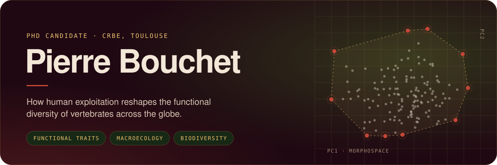
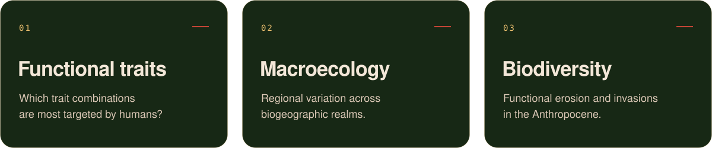

<!-- Assets live in /assets. Each visual has a dark and a light version; GitHub picks the one matching the viewer's theme. -->

<picture>
  <source media="(prefers-color-scheme: light)" srcset="assets/header-light.svg">
  
</picture>

  <a href="https://pierrolaloune.github.io"><picture><source media="(prefers-color-scheme: light)" srcset="assets/link-website-light.svg"></picture></a>
  <a href="https://orcid.org/0009-0000-5907-9364"><picture><source media="(prefers-color-scheme: light)" srcset="assets/link-orcid-light.svg"></picture></a>
  <a href="https://www.researchgate.net/profile/Pierre-Bouchet-2"><picture><source media="(prefers-color-scheme: light)" srcset="assets/link-researchgate-light.svg"></picture></a>
  <a href="https://www.linkedin.com/in/pierrebouchetprofile/"><picture><source media="(prefers-color-scheme: light)" srcset="assets/link-linkedin-light.svg"></picture></a>
  <a href="https://bsky.app/profile/pbouchet.bsky.social"><picture><source media="(prefers-color-scheme: light)" srcset="assets/link-bluesky-light.svg"></picture></a>

 

<picture>
  <source media="(prefers-color-scheme: light)" srcset="assets/sec-about-light.svg">
  
</picture>

Geographer by training, I am a PhD candidate at the [CRBE](https://crbe.cnrs.fr/), Université de Toulouse. I use trait-based approaches and large-scale macroecological analyses to study how human exploitation of vertebrates reshapes functional diversity and morphospace across biogeographic realms.

 

<picture>
  <source media="(prefers-color-scheme: light)" srcset="assets/sec-research-light.svg">
  
</picture>

 

<picture>
  <source media="(prefers-color-scheme: light)" srcset="assets/research-light.svg">
  
</picture>

  

<picture>
  <source media="(prefers-color-scheme: light)" srcset="assets/sec-toolbox-light.svg">
  
</picture>

 

<picture>
  <source media="(prefers-color-scheme: light)" srcset="assets/toolbox-light.svg">
  
</picture>
